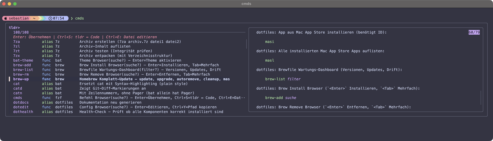
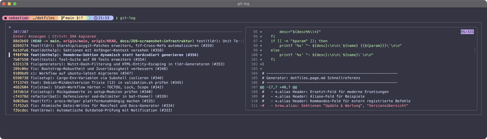
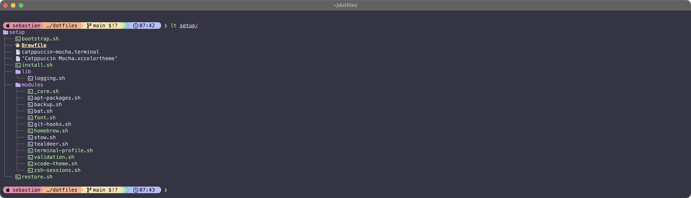

# 🍎 dotfiles

[](https://github.com/tshofmann/dotfiles/actions/workflows/validate.yml)
[](LICENSE)
[](https://www.apple.com/macos/)
[](https://kernel.org/)
[](https://www.zsh.org/)

<p align="center">
  
  <br>
  <em>cmds – alle Aliase und Funktionen durchsuchen (einer von 20+ fzf-Workflows)</em>
</p>

**Dotfiles mit modernen CLI-Tools, einheitlichem Theme und integrierter Hilfe.**

> ⚠️ **Plattform-Status:** Auf **macOS** produktiv getestet. Linux-Bootstrap (Fedora, Debian, Arch) in Docker/Headless validiert – Desktop (Wayland) und echte Hardware noch ausstehend.

## ✨ Was du bekommst

| Vorher | Nachher | Vorteil |
| ------ | ------- | ------- |
| `cat` | `bat` | mit Syntax-Highlighting |
| `cd` | `zoxide` | lernt häufige Verzeichnisse |
| `find` | `fd` | schneller, intuitive Syntax |
| `grep` | `rg` | schneller, respektiert .gitignore |
| `ls` | `eza` | mit Icons und Git-Status |
| `top` | `btop` | moderner Ressourcen-Monitor |

### Interaktive Workflows (fzf)

Alle Workflows nutzen [fzf](https://github.com/junegunn/fzf) mit bat-Preview, Keybindings und Catppuccin-Theming:

| Bereich | Funktionen |
| ------- | ---------- |
| Git | `git-log`, `git-branch`, `git-stage`, `git-stash` |
| GitHub | `gh-pr`, `gh-issue`, `gh-run`, `gh-repo`, `gh-gist` |
| System | `procs`, `help`, `cmds`, `vars` |
| Navigation | `jump`, `pick`, `zj` |
| Suche | `rg-live` |
| Pakete | `brew-add`, `brew-rm` |

<p align="center">
  
  <br>
  <em>git-log – Commit-Historie mit Diff-Preview (bat + Catppuccin Syntax-Highlighting)</em>
</p>

### Media-Toolkit

| Tool | Funktionen |
| ---- | ---------- |
| ffmpeg | `v2mp3`, `vthumb`, `vcut`, `vcompress`, `v2gif`, `v2mp4`, `vinfo` |
| magick | `imgresize`, `towebp`, `topng`, `tojpg`, `imgmeta`, `imgsize`, `imgcrop`, `imgstrip` |
| poppler | `pdf2txt`, `pdf2img`, `pdfmeta`, `pdfpages`, `pdfsplit`, `pdfmerge` |
| resvg | `svg2png`, `svgscale` |

Dazu: **[Catppuccin Mocha](https://catppuccin.com/) Theme** überall, **Hilfe im Terminal** via `dothelp`, **fzf-Integration** für alles.

<p align="center">
  
  <br>
  <em>lt – eza Tree-View mit Nerd Font Icons und Catppuccin Mocha Farben</em>
</p>

Alle installierten Pakete: [`setup/Brewfile`](setup/Brewfile)

## 🚀 Installation

```bash
curl -fsSL https://github.com/tshofmann/dotfiles/archive/refs/heads/main.tar.gz | tar -xz -C ~ && mv ~/dotfiles-main ~/dotfiles && ~/dotfiles/setup/install.sh
```

Bestehende Konfigurationen werden automatisch gesichert. Wiederherstellung: `~/dotfiles/setup/restore.sh`

Danach **Terminal neu starten**. Fertig!

> 💡 **Tipp:** Gib `dothelp` ein – zeigt alle Aliase, Shortcuts und Wartungsbefehle.
>
> ⚠️ **Probleme?** `dothealth` prüft die Installation.

### Voraussetzungen

#### macOS (getestet ✅)

- **Apple Silicon oder Intel Mac** (arm64/x86_64)
- **macOS 26+** (Tahoe)
- **Internetverbindung** & Admin-Rechte

#### Linux (vorbereitet 🔧)

- **Fedora / Debian / Arch** – Bootstrap + Plattform-Abstraktionen in Docker/Headless validiert (Desktop/Hardware ausstehend)
- macOS-spezifische Module werden automatisch übersprungen

## 📖 Dokumentation

| Befehl | Was es zeigt |
| ------ | ------------ |
| `dothelp` | Schnellreferenz: Aliase, Shortcuts, Tool-Ersetzungen, Wartung |
| `cmds` | Alle Aliase und Funktionen interaktiv durchsuchen |
| `tldr <tool>` | Vollständige Tool-Doku mit dotfiles-Erweiterungen |

Mehr: [Setup](docs/setup.md) · [Anpassung](docs/customization.md) · [Contributing](CONTRIBUTING.md)

## Lizenz

[MIT](LICENSE)
